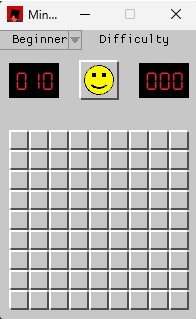
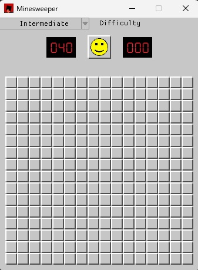
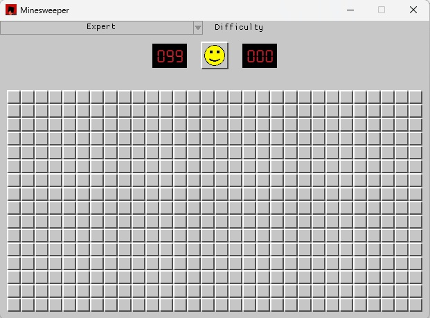
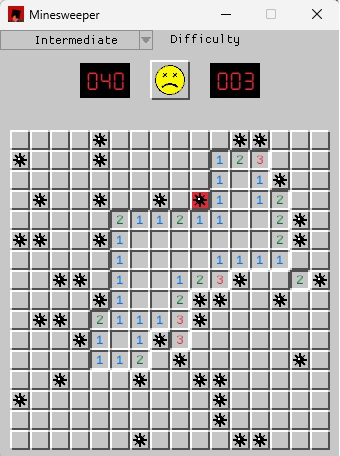

A classic Minesweeper game built in Rust using the Macroquad game engine.

### Features

- Classic Minesweeper gameplay
- Three difficulty levels (Beginner, Intermediate, Expert)
- Left click to reveal cell and interact with smiley face
- Right click to place/remove flags
- Custom-drawn graphics (no external assets, except font)
- Embedded font for timer and flags counters: 
    [Digit Tech](https://www.1001fonts.com/digit-tech-font.html) (Public Domain)

### Todo

- Add mouse down/released for grid interaction (Done)
- Add chording

### Prerequisites
- Pre-installed Rust
- Cargo

### Build and Run

```bash
git clone https://github.com/Andrei017017/rust-minesweeper.git
cd minesweeper
cargo run --release
```

### Beginner Mode


### Intermediate Mode


### Expert Mode


### Game Over
